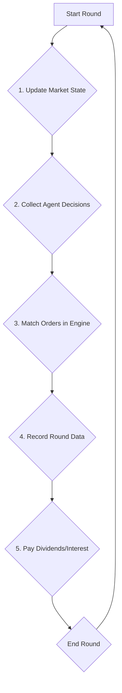

# LLM Trading Simulation

This repository contains the source code for a trading simulation environment powered by Large Language Models (LLMs).

## Description

This project simulates a financial market where agents, powered by LLMs, make trading decisions.

## Setup

1.  **Clone the repository:**
    ```bash
    git clone <your-repository-url>
    cd LLMTradingSimulation_public
    ```

2.  **Create a virtual environment:**
    It is highly recommended to use a virtual environment. For example, with conda:
    ```bash
    conda create -n llm_trading python=3.11
    conda activate llm_trading
    ```

3.  **Install dependencies:**
    ```bash
    pip install -r requirements.txt
    ```

4.  **Configure Environment Variables:**
    This project requires an `OPENAI_API_KEY` to be stored in a `.env` file at the root of the project. This file is not tracked by Git for security reasons. 

    You will need to create this file yourself and add your key like this:
    ```
    OPENAI_API_KEY="sk-..."
    ```

## Usage

To run the simulation, you can execute the `run_base_sim.py` script from the `src/` directory.

1.  **List Available Scenarios:**
    To see a list of all available scenarios and their descriptions, run:
    ```bash
    python3 src/run_base_sim.py --list
    ```

2.  **Run a Specific Scenario:**
    To run a specific scenario, provide its name as a command-line argument. For example, to run the `price_discovery_above_fundamental` scenario:
    ```bash
    python3 src/run_base_sim.py price_discovery_above_fundamental
    ```

    If you run the script without any arguments, it will display a list of available scenario names.

    Simulation results, including plots and data, will be saved in the `logs/` directory.

## Simulation Lifecycle

The simulation operates in discrete rounds. The following diagram illustrates the sequence of events that occur in each round:



This lifecycle is orchestrated by the `execute_round` method in `src/base_sim.py`.

## Adding New Scenarios

You can define custom scenarios by adding new `SimulationScenario` objects to the `SCENARIOS` dictionary in `src/scenarios.py`.

Each scenario requires:
- A unique `name`.
- A `description`.
- A `parameters` dictionary, which can override the `DEFAULT_PARAMS`.

Here is an example of a new scenario definition:
```python
# src/scenarios.py

"my_custom_scenario": SimulationScenario(
    name="my_custom_scenario",
    description="A custom scenario for testing a new agent type.",
    parameters={
        **DEFAULT_PARAMS,
        "NUM_ROUNDS": 5,
        "AGENT_PARAMS": {
            **DEFAULT_PARAMS["AGENT_PARAMS"],
            'agent_composition': {
                'my_new_agent': 1,
                'market_maker': 1,
            },
        }
    }
),
```
After adding your new scenario, you can run it by providing its name as a command-line argument as described above. 